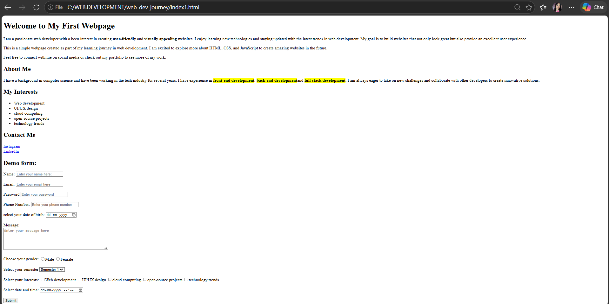

# Day 1 – HTML Basics, Lists & Forms 🚀

## 📚 What I Learned

- Basic structure of an HTML page (`<!DOCTYPE html>`, `<html>`, `<head>`, `<body>`)
- Headings, paragraphs, and text formatting (`<h1>`, `
`, `<b>`, `<mark>`)
- Creating lists using `<ul>` and `<li>`
- Adding links using `<a>`
- Building forms with different input types

---

## 💻 Project: Personal Intro Webpage

Created a simple personal webpage that includes:

- Introduction section  
- About Me section  
- Interests list  
- Social media links  
- Interactive form  

---

## 🧠 Key Concepts Used

### 🔹 Text & Formatting
- Used headings and paragraphs to structure content  
- Highlighted text using `<mark>`  
- Bold text using `<b>`  

### 🔹 Lists
- Created an unordered list to display interests  

### 🔹 Links
- Added clickable links for Instagram and LinkedIn  

### 🔹 Forms (Main Focus)

Built a complete form using:

- Text input (Name)  
- Email input  
- Password input  
- Phone number input  
- Date picker  
- Radio buttons (Gender selection)  
- Checkboxes (Interests)  
- Dropdown (Semester selection)  
- Textarea (Message box)  
- Submit button  

---

## 🚀 Output Preview

---

## 📁 Files Included

- `index.html` – Main webpage  
- `preview.png` – Screenshot of output  
- `README.md` – Documentation  

---

## 🔥 Key Takeaways

- Learned how to structure a basic webpage  
- Gained hands-on experience with forms  
- Understood how different HTML elements work together  

---

## 📈 Progress

Day 1 complete ✅  
Built a strong foundation in HTML basics and forms.
