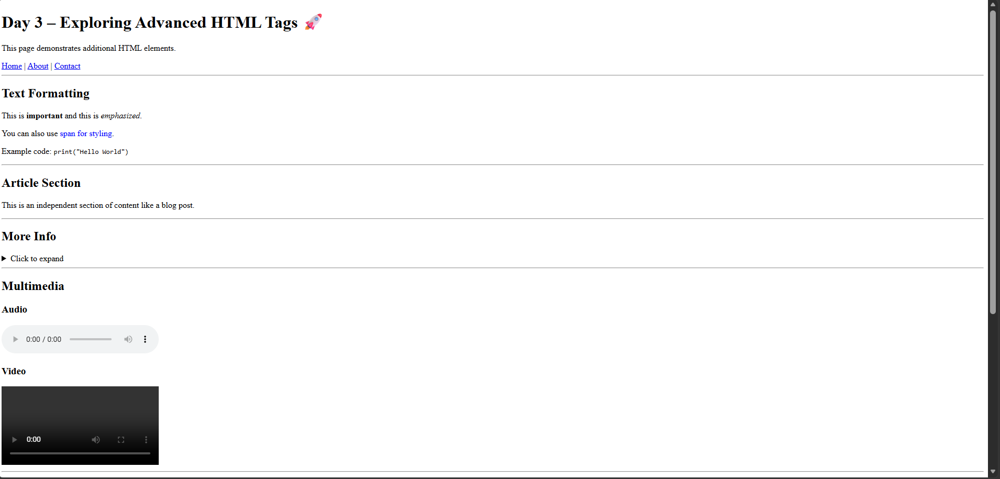
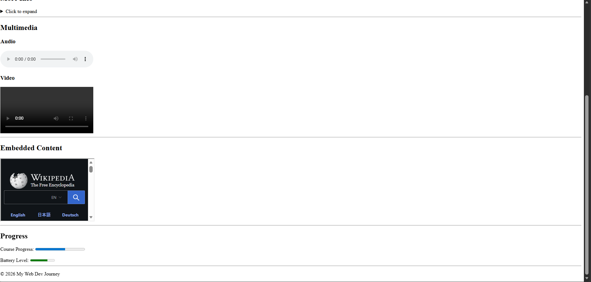

\# 📅 Day 03 – Advanced HTML Tags 🚀

\## 🌟 Overview

On Day 3, I explored \*\*advanced and semantic HTML elements\*\* that help structure webpages better and improve accessibility.

This was a big step from basic HTML — moving towards writing \*\*clean, meaningful, and modern code\*\*.

\---

\## 🧠 What I Learned

\### 🏗️ Semantic Structure

\* `<header>` – Top section of the page

\* `<nav>` – Navigation links

\* `<section>` – Grouping related content

\* `<article>` – Independent content block

\* `<footer>` – Bottom section

\---

\### ✨ Text \& Inline Elements

\* `<strong>` – Important text

\* `<em>` – Emphasized text

\* `` – Inline styling

\* `<code>` – Display code snippets

\---

\### 📂 Interactive Elements

\* `
` \& `
` – Expandable content

\---

\### 🎧 Multimedia

\* `<audio>` – Adding audio

\* `<video>` – Embedding video

\---

\### 🌐 Embedded Content

\* `<iframe>` – Embedding external websites

\---

\### 📊 Utility Elements

\* `<progress>` – Progress indicator

\* `<meter>` – Measurement display

\---

\## 💻 What I Built

A structured webpage demonstrating:

\* Semantic layout (header, nav, sections, footer)

\* Text formatting and inline elements

\* Interactive dropdown content

\* Embedded media and external content

\* Progress and meter indicators

\---

\## 📸 Preview

&#x20; 

&#x20; 

\---

\## 🧠 Key Takeaways

\* Semantic HTML improves \*\*readability and SEO\*\*

\* HTML is not just structure — it can handle \*\*interactivity too\*\*

\* Clean structure makes future CSS styling much easier

\---

\## 📂 Files in This Folder

\* `index.html` → Advanced HTML implementation

\* `preview.png` → Output preview

\---

\## 🔄 Progress

✔️ Day 01 – HTML Basics

✔️ Day 02 – HTML Tables

✔️ Day 03 – Advanced HTML

⏳ Day 04 – CSS Begins 🎨

\---

\## 💡 Reflection

This day helped me understand how to structure a webpage like a real developer.

Using semantic tags made the code more organized and meaningful.

\---

✨ <b>"From structure to styling — the real fun begins now."</b>

