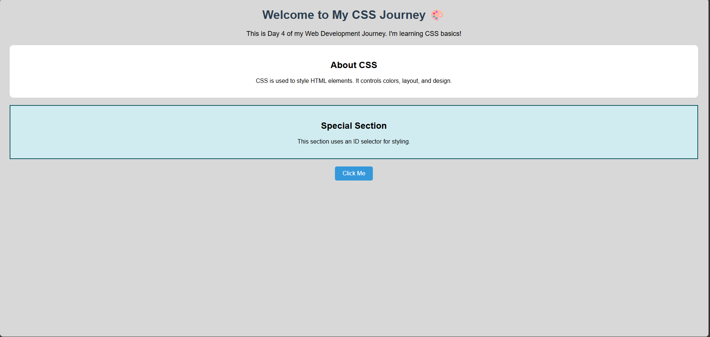

# 🎨 Day 4 – CSS Basics

Welcome to **Day 4** of my Web Development Journey 🚀
Today I stepped into the world of **CSS (Cascading Style Sheets)** and learned how to make web pages look beautiful and structured.

---

## 📚 What I Learned

✨ Introduction to CSS
✨ Types of CSS:

* Inline CSS
* Internal CSS
* External CSS

✨ Selectors:

* Element Selector
* Class Selector
* ID Selector

✨ Basic Styling:

* Colors 🎨
* Backgrounds 🖌️
* Fonts & Text Styling ✍️
* Alignment

✨ Button Styling with Hover Effects 🖱️

---

## 🧠 Concepts Covered

✔️ Linking CSS with HTML
✔️ Writing clean and reusable styles
✔️ Understanding how selectors work
✔️ Applying styles to different elements

---

## 📸 Preview



---

## 📁 Project Structure

```
Day-4-CSS/
│── index.html
│── style.css
│── preview.png
│── README.md
```

---

## 🚀 How to Run

1. Download or clone the repository
2. Open `index.html` in your browser
3. Explore the styled webpage

---

## 💡 Key Takeaway

CSS transforms plain HTML into visually appealing designs.
Even basic styling can significantly improve user experience.

---

## 🔗 Connect With Me

I’m documenting my journey daily — stay tuned for more! 🚀

---

⭐ Don’t forget to check out my previous days and upcoming projects!


