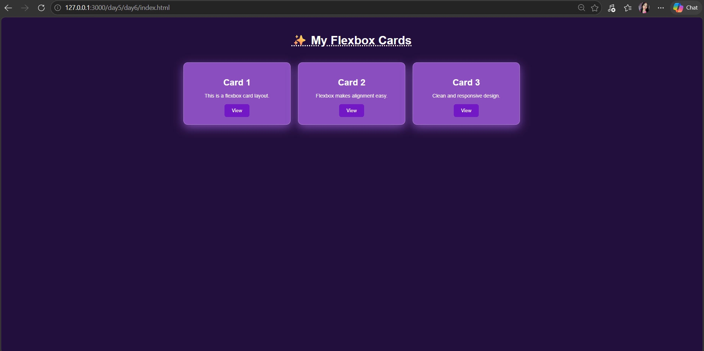

# 💜 Day 6 – Flexbox Card Layout

Welcome to **Day 6** of my Web Development Journey 🚀
Today I explored **Flexbox** and used it to build a responsive **card layout** with a dark purple aesthetic.

---

## 🧠 What I Learned

* Flexbox fundamentals (`display: flex`)
* Aligning items using:

  * `justify-content`
  * `align-items`
* Spacing using `gap`
* Responsive layout with `flex-wrap`
* Improving UI with colors, shadows, and hover effects

---

## 🎯 Project

Built a **Flexbox Card Layout** consisting of multiple cards aligned in a clean and responsive structure.

### ✨ Features

* 💜 Dark purple aesthetic theme
* 📱 Responsive layout (cards wrap on smaller screens)
* 🎴 Reusable card component
* 🌫️ Soft shadows for depth
* 🔘 Interactive button hover effect

---

## 📸 Preview

---

## 📁 Project Structure

Day-6-Flexbox/
│── index.html
│── style.css
│── preview.png
│── README.md

---

## 🚀 How to Run

1. Clone or download the repository
2. Open `index.html` in your browser
3. Resize the screen to see Flexbox in action

---

## 💡 Key Takeaway

Flexbox makes layout design simple and powerful.
It helps in aligning elements efficiently and creating responsive designs with minimal code.

---

## 📅 Progress

* Day 1 – HTML Basics
* Day 2 – Tables
* Day 3 – Advanced HTML
* Day 4 – CSS Basics 🎨
* Day 5 – Box Model 📦
* Day 6 – Flexbox 💜

---

⭐ More coming soon — next up: **Positioning & Navbar**
