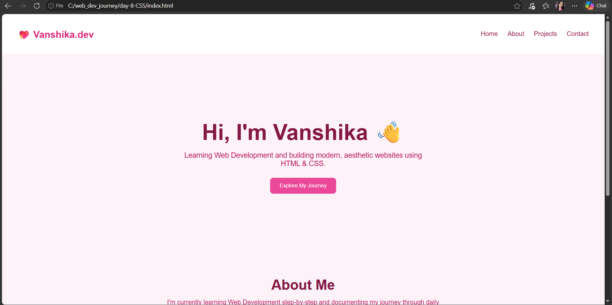

# Day 08 – Responsive Portfolio 🌸

## 📚 What I Learned
- Building a full responsive portfolio layout from scratch
- Sticky navbar with flexbox navigation
- Hero section with large heading and call-to-action button
- Project cards with hover lift effect using `translateY()` and `box-shadow`
- `flex-wrap` to allow cards to wrap on smaller screens
- Mobile-first responsive design using `@media (max-width: 768px)`

## 🛠️ What I Built
A pink-themed responsive portfolio page with:
- Sticky navbar with logo and nav links
- Hero section with heading, tagline and CTA button
- About section
- Project cards with smooth hover animations
- Footer
- Fully responsive layout that adapts to mobile screens

## 📸 Preview

  
  

## 💡 Key Takeaway
`flex-wrap: wrap` is essential for responsive card grids — it lets cards naturally flow to the next line instead of overflowing. Combined with `@media` queries, you can completely reshape the layout for mobile without writing separate CSS files.

