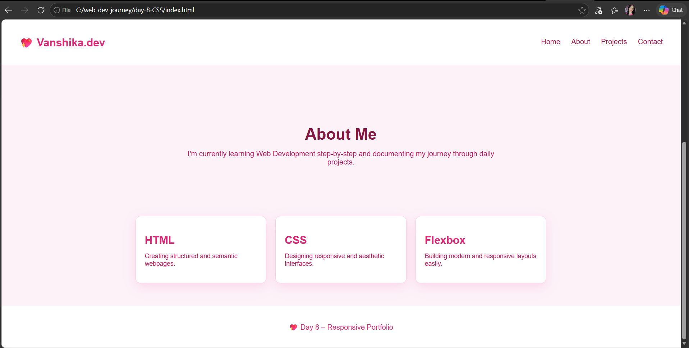

# Day 07 – Navbar & Landing Page 🌸

## 📚 What I Learned
- Sticky navbar using `position: sticky` and `top: 0`
- Flexbox for navbar layout with `justify-content: space-between`
- Hover effects using `transition` and `transform: scale()`
- Card lift effect with `translateY()` and `box-shadow`
- Responsive design with `@media (max-width: 768px)`
- Consistent color theming using a pink palette throughout

## 🛠️ What I Built
A pink-themed landing page with:
- Sticky navbar with logo and nav links
- Hero section with heading, subtext and CTA button
- About section
- Hoverable feature cards with shadow effects
- Footer
- Fully responsive layout for mobile screens

## 📸 Preview

  
  

## 💡 Key Takeaway
`position: sticky` keeps the navbar visible while scrolling without taking it out of the document flow — unlike `position: fixed`. Combining `transition` with `transform` makes hover animations smooth and satisfying.
