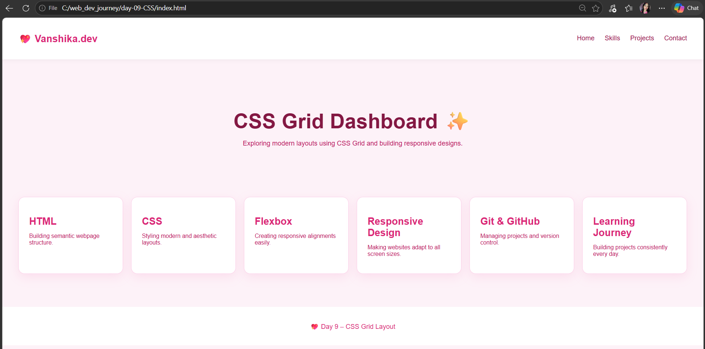
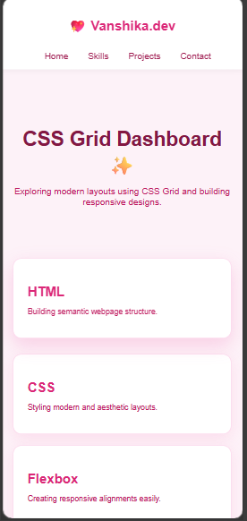

# Day 9 — CSS Grid 🟪

A responsive card layout built with **CSS Grid**, featuring a sticky navbar, hero section, and hover-animated cards. Part of my 30-day frontend learning journey.

---

## 🔍 What I Practiced

- `display: grid` to create a card layout
- `grid-template-columns: repeat(auto-fit, minmax(250px, 1fr))` for automatic responsive columns
- `gap` property for clean spacing between grid items
- Combined **Flexbox** (navbar) + **Grid** (card layout) in one project
- `position: sticky` navbar
- Hover transitions with `transform: translateY()`
- Media queries for mobile responsiveness

---

## 📸 Preview

<p align="center">
  
  
</p>

<p align="center">
  💻 Desktop View &nbsp;&nbsp;&nbsp;&nbsp;&nbsp;&nbsp;&nbsp;&nbsp; 📱 Mobile View
</p>
---

## 🧠 Key Concept

```css
.grid-container {
  display: grid;
  grid-template-columns: repeat(auto-fit, minmax(250px, 1fr));
  gap: 20px;
}
```

`auto-fit` + `minmax()` makes the grid **automatically responsive** — no media query needed for the columns. The grid figures out how many columns fit based on screen width.

---

## 📁 Files

```
day-09-css-grid/
├── index.html
├── style.css
└── README.md
```

---

## 🚀 How to Run

Just open `index.html` in your browser — no setup needed.

---

## 📅 Series

| Day | Topic |
|-----|-------|
| 04 | CSS Basics |
| 05 | Box Model |
| 06 | Flexbox |
| 07 | Navbar + Landing Page |
| 08 | Responsive Portfolio |
| **09** | **CSS Grid ← you are here** |
