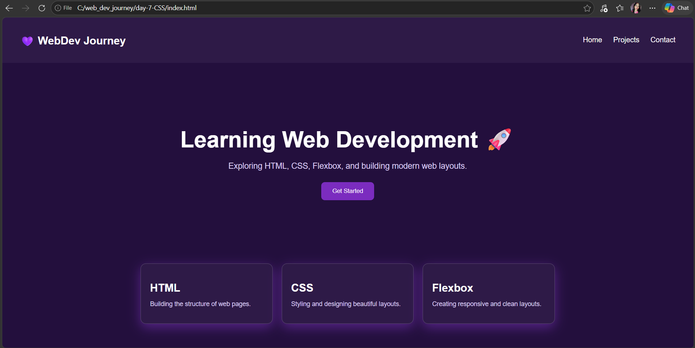

# 💜 Day 7 – Navbar Landing Page

Welcome to **Day 7** of my Web Development Journey 🚀  
Today I built my first mini landing page using HTML & CSS.

---

## 🧠 What I Learned

- Creating a responsive navbar
- Using Flexbox for layouts
- Hero section design
- CSS positioning (`sticky`)
- Reusable card components
- Hover effects & transitions

---

## 🎯 Project

Built a modern landing page consisting of:

- 💜 Navigation Bar  
- 🚀 Hero Section  
- 🎴 Cards Section  
- ✨ Hover Effects  

---

## 📸 Preview

---

## 📁 Project Structure

Day-7-Navbar-Landing-Page/  
│── index.html  
│── style.css  
│── preview.png  
│── README.md  

---

## 🚀 How to Run

1. Download or clone the repository  
2. Open `index.html` in your browser  

---

## 💡 Key Takeaway

This project helped me understand how real webpages are structured using Flexbox and positioning.

---

## 📅 Progress

- Day 1 – HTML Basics  
- Day 2 – Tables  
- Day 3 – Advanced HTML  
- Day 4 – CSS Basics 🎨  
- Day 5 – Box Model 📦  
- Day 6 – Flexbox 💜  
- Day 7 – Navbar Landing Page 🚀  

---

⭐ More projects coming soon!
